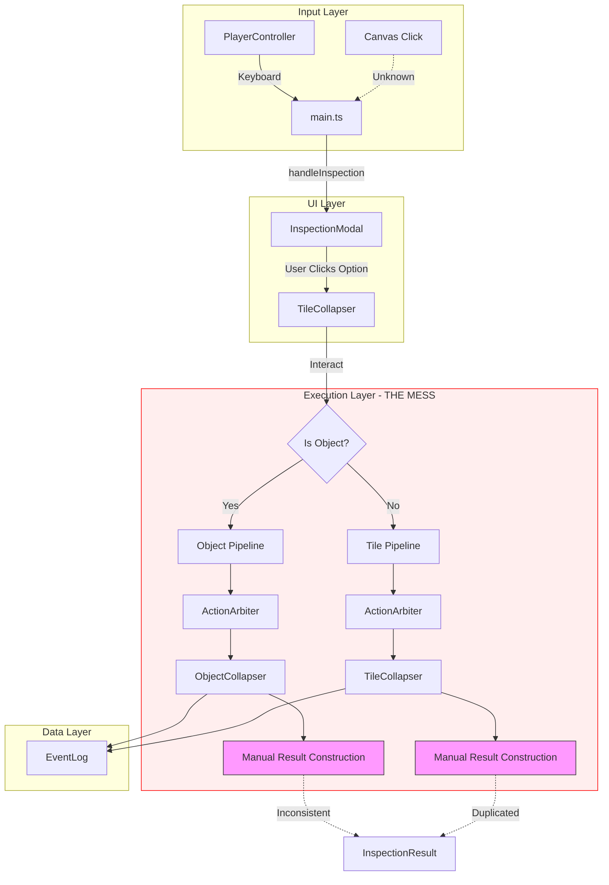

# Pipeline Unification Plan

## 1. System Map

The current architecture flows from User Input to Game Logic through the following stages:

## 2. Identified Violations

### A. The "Execution Fork" (Critical)
**Location**: `src/entities/TileCollapser.ts`
**Severity**: High
**Description**: The `interactWithTile` function acts as a Manual Router that forks logic based on whether the target is an Object or a Tile.
- **Violation**: DRY (Don't Repeat Yourself). The logic for Arbitration, Skill Checks, and Result Parsing is duplicated.
- **Consequence**: Bug proliferation (e.g., the recent "duplicate skill check text" bug happened because we fixed one path and ignored the other).
- **Evidence**: `collapseObjectContents` returns a different shape than `interactWithTileType`, forcing `TileCollapser` to manually reshape both into `InspectionResult`.

### B. Input Wiring Opacity (Minor)
**Location**: `src/main.ts`
**Severity**: Low
**Description**: While Keyboard input is clearly handled by `PlayerController`, the Mouse input mechanism is implicit (likely handled by `DungeonRenderer` or raw event listeners not immediately visible in `main.ts`).
- **Consequence**: Difficulty tracking "Click-to-Move" vs "Click-to-Inspect" logic.

### C. Logic Leaking (Moderate)
**Location**: `src/entities/ObjectCollapser.ts`
**Severity**: Medium
**Description**: The `ObjectCollapser` handles some logic that belongs in `ActionArbiter` (e.g., deciding if an object is destroyed).
- **Violation**: Separation of Concerns. The "Physics/Logic" of destruction should be distinct from the "Semantic" description of it.

## 3. Unification Strategy

We will focus on fixing **Violation A (The Execution Fork)** immediately as it poses the highest risk to stability.

### Pattern: The "Result Builder"
We will unify the pipelines by extracting the **Termination Step** (Result Construction) into a shared helper function.

#### Step 1: Standardize Internal Returns
Ensure `collapseObjectContents` and `interactWithTileType` return a compatible `InteractionResponse` interface (Message + Items + Outcome).

#### Step 2: Extract `buildInteractionResult`
Create a helper function `buildInteractionResult` that takes the raw outputs and constructs the final `InspectionResult`. This ensures that fields like `mechanics` are handled identically.

#### Step 3: Refactor `interactWithTile`
Refactor the main controller to:
1.  **Detect Context**: (Object vs Tile).
2.  **Run Simulation**: Call the specific Collapser.
3.  **Unify Output**: Pass the result to `buildInteractionResult`.

### Refactoring Roadmap

#### Phase 1: Preparation (Safe)
- [ ] Create `buildInteractionResult` helper function (pure function).
- [ ] Define shared `SimulatedInteraction` interface.

#### Phase 2: Object Path Migration (Low Risk)
- [ ] Refactor `interactWithTile` Object block to use `buildInteractionResult`.
- [ ] Verify functionality (Interact with "Crude Food Carvings").

#### Phase 3: Tile Path Migration (Medium Risk)
- [ ] Refactor `interactWithTile` Tile block to use `buildInteractionResult`.
- [ ] Verify functionality (Interact with "Stone Archway").

#### Phase 4: Cleanup
- [ ] Remove dead code (manual result construction blocks).
